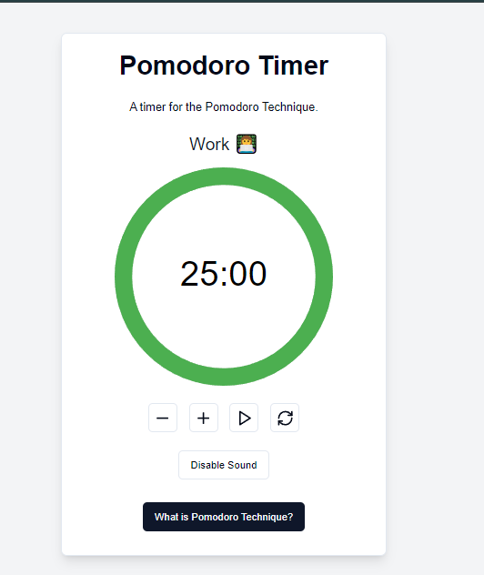

# Pomodoro Timer

## Overview

The **Pomodoro Timer** is a web application that helps users implement the Pomodoro Technique, a time management method that encourages people to work in focused intervals, traditionally 25 minutes in length, followed by short breaks. This app is built using **Next.js**, **React**, and **TypeScript**, providing a responsive and interactive user experience.

## Features

- Customizable work and break durations.
- Visual countdown timer with progress indication.
- Sound notifications when a session ends.
- Informative alert dialog explaining the Pomodoro Technique.
- Dark mode support for better visibility.
- Easy-to-use interface with buttons for starting, pausing, and resetting the timer.
- Responsive design for optimal performance on both desktop and mobile devices.

## Prerequisites

Make sure you have the following installed:

- Node.js (v14 or higher)
- npm or Yarn

## Usage

1. **Set Work and Break Durations**: Use the "+" and "-" buttons to adjust your work and break times.
2. **Start the Timer**: Click the play button to start the timer for your work session.
3. **Pause and Resume**: Use the pause button to temporarily stop the timer, and click play to resume.
4. **Reset the Timer**: Click the reset button to return to the default work duration.
5. **Sound Notifications**: Toggle sound notifications on or off as per your preference.
6. **Learn About the Technique**: Click on "What is Pomodoro Technique?" to learn more about this time management method.

## Technologies Used

- **Next.js**: A React framework for building server-rendered applications.
- **React**: A JavaScript library for building user interfaces.
- **TypeScript**: A typed superset of JavaScript that compiles to plain JavaScript.
- **Tailwind CSS**: A utility-first CSS framework for styling.
- **lucide-react**: An icon library used for user interface icons.
- **react-circular-progressbar**: A library for displaying circular progress indicators.

## Acknowledgments

- Inspired by the Pomodoro Technique.
- Thanks to the contributors of the libraries used in this project.
- Special thanks to [Sir Asharib Ali](https://github.com/AsharibAli) for guiding me in building this project.
